# An Attempt to Manipulate the Latent Space of GANs for Semantic Face Editing

For this starter project, I played with the latent space of StyleGAN (Karras *et al.*, CVPR 2019) and made an attempt at tackling the disentanglement of facial attributes, a task discussed in the original StyleGAN paper. The goal is to turn an unconditionally trained GAN model into a controllable one, which means that the model can edit a particular facial attribute without affecting another.

While the StyleGAN paper has already found that the intermediate latent space $\mathcal{W}$ is less entagled by $\mathcal{Z}$, there exists another approach proposed in the CVPR paper "Interpreting the Latent Space of GANs for Semantic Face Editing" ((Shen *et al.*, CVPR 2020)) called "conditional manipulation". The authors of the paper first prove that the latent space $\mathcal{Z}$ of StyleGAN is separable by a hyperplane given any facial attributes, and then find a projected direction along which moving the latent code changes attribute A without affecting attribute B.

The purpose of this project is thus to try my hand at using a GAN model for face editing, and do a little compare-and-contrast between the two disentanglement methods. A Colab demo can be found [here](https://colab.research.google.com/github/yuzq97/starter_project/blob/main/demo.ipynb).

## Model for Face Generation

The Tensorflow version of StyleGAN requires a GPU to run, but thanks to Shen *et al.*, I was able to use a PyTorch version of it which supports running on CPU. The model first loads the weights from the pre-trained StyleGAN, randomly samples latent codes which is then linearly interpolated with respect to the given boundary, and finally synthesizes result images from the new latent code.

## Training Process
The training part of this projects involves finding boundaries for various facial attributes, both unconditioned and conditional ones. Training unconditioned boundaries requires an attribute score predictor, and to avoid over complicate the work, I used the pre-trained unconditioned boundaries. I was then able to generate myself a handful of conditional boundaries using the function `project_boundary()` in `utils/manipulator.py`, which takes in a primal boundary and another one or two boundaries, and returns the modified primal boundary conditioned on the other boundaries.

## Using edit.py

This script is for face editing, and it is the easiest way to play around with various combinations of models and boundaries to see the differences.

Before use, please first download StyleGAN models from https://github.com/NVlabs/stylegan, and then put them under `models/pretrain/`. Both StyleGAN models trained on CelebA-HQ and FFHQ dataset are supported.

### Arguments:

-m: Model used for generating images, either "stylegan_ffhq" or "stylegan_celebahq". \
-o: Directory to save the output results. \
-b: Path to the semantic boundary. All boundaries are saved under `boundaries/` in the form of `{attribute_name}_boundary.npy` for $\mathcal{Z}$ space and `{attribute_name}_w_boundary.npy` for $\mathcal{W}$ space.\
-n: Number of images for editing. \
-s: Latent space used in StyleGAN, either "W" or "Z". ("Z" by default)

## Results
In this project, I examined five prominent facial attributes: age, gender, eyeglasses, pose, and smile. To determine which of the two disentaglement methods achieves better effect, I used the same set of images for them to edit. The results are as follows:

### 1. Age
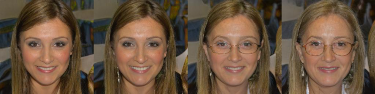 \
**Figure:** *result of editing in $\mathcal{Z}$ space* \
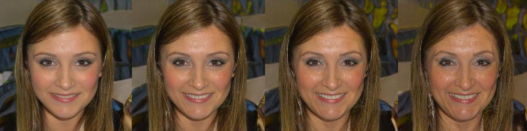 \
**Figure:** *result of editing in $\mathcal{W}$ space* \
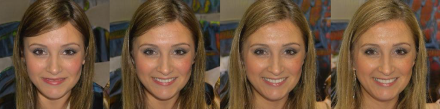 \
**Figure:** *result of editing in $\mathcal{Z}$ space conditioned on eyeglasses*

### 2. Gender
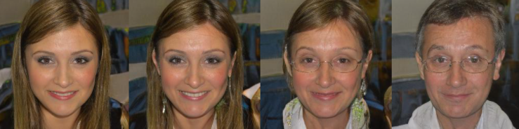 \
**Figure:** *result of editing in $\mathcal{Z}$ space* \
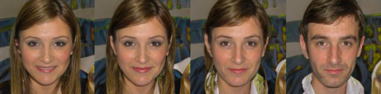 \
**Figure:** *result of editing in $\mathcal{W}$ space* \
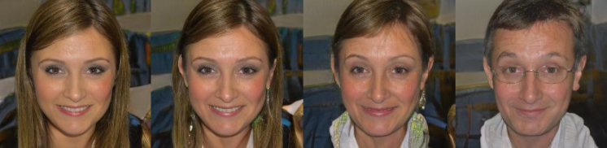 \
**Figure:** *result of editing in $\mathcal{Z}$ space conditioned on age* \
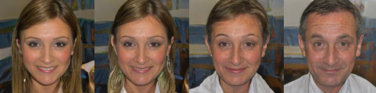 \
**Figure:** *result of editing in $\mathcal{Z}$ space conditioned on eyeglasses*

### 3. Eyeglasses
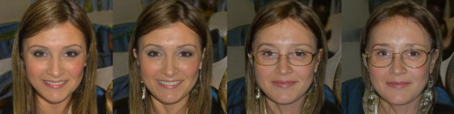 \
**Figure:** *result of editing in $\mathcal{Z}$ space* \
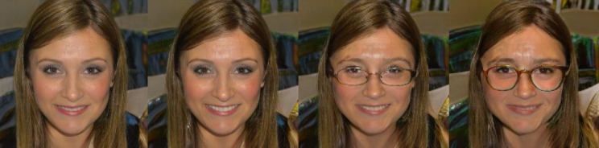 \
**Figure:** *result of editing in $\mathcal{W}$ space* \
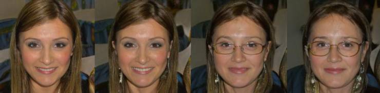 \
**Figure:** *result of editing in $\mathcal{Z}$ space conditioned on smile* \
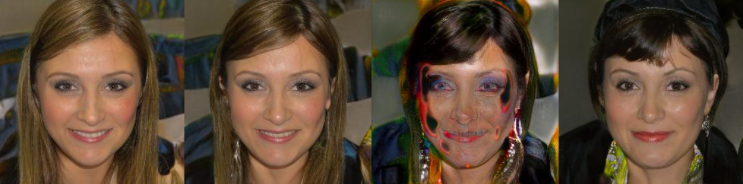 \
**Figure:** *result of editing in $\mathcal{Z}$ space conditioned on age*

### 4. Pose
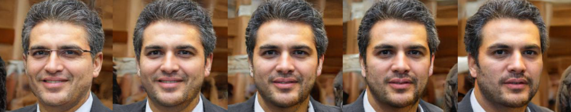 \
**Figure:** *result of editing in $\mathcal{Z}$ space* \
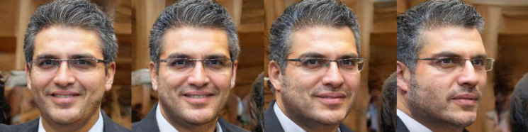 \
**Figure:** *result of editing in $\mathcal{W}$ space* \
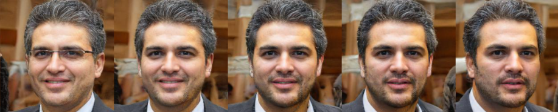 \
**Figure:** *result of editing in $\mathcal{Z}$ space conditioned on eyeglasses* \
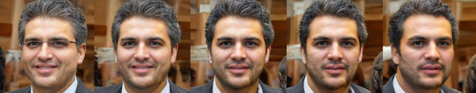 \
**Figure:** *result of editing in $\mathcal{Z}$ space conditioned on smile*

### 5. Smile
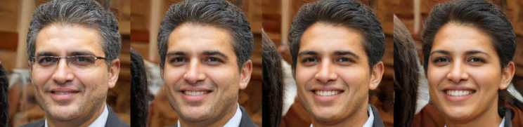 \
**Figure:** *result of editing in $\mathcal{Z}$ space* \
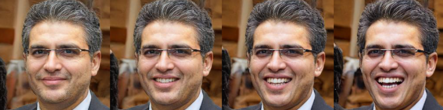 \
**Figure:** *result of editing in $\mathcal{W}$ space* \
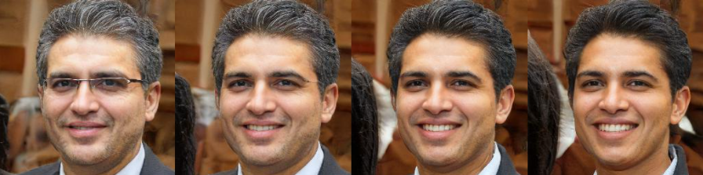 \
**Figure:** *result of editing in $\mathcal{Z}$ space conditioned on eyeglasses* \
 \
**Figure:** *result of editing in $\mathcal{Z}$ space conditioned on gender*

\
We can see that conditional manipulation in $\mathcal{Z}$ space performs well on age, but gets somewhat mediocre results on others: editing gender conditioned on age and pose/smile conditioned on eyeglasses still change the conditioned attributes, and editing eyeglasses conditioned on age fails terribly.

On the other hand, manipulation in $\mathcal{W}$ space is quite consistent in producing the desired images. It is perhaps only outperformed by conditional manipulation when editing eyeglasses, as the resulting image from conditional manipulation seems more natural. In fact, condition manipulation generally produces images that look more like a real person.  

## References
- [A Style-Based Generator Architecture for Generative Adversarial Networks](https://arxiv.org/pdf/1812.04948.pdf), Karras *et al.*, CVPR 2019
- [Interpreting the Latent Space of GANs for Semantic Face Editing](https://arxiv.org/pdf/1907.10786.pdf), Shen *et al.*, CVPR 2020
